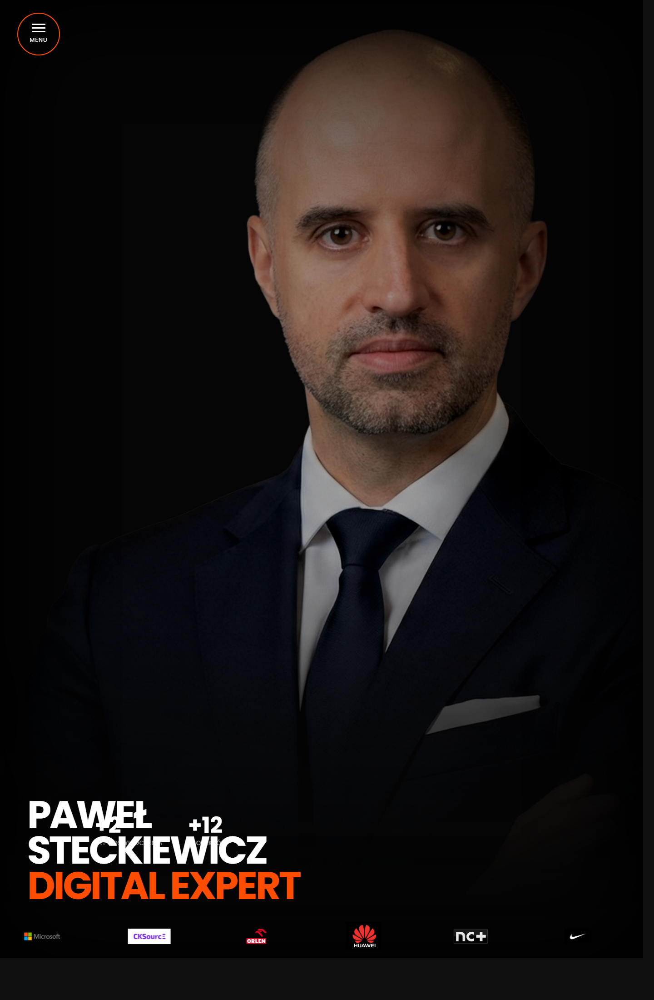

# Paweł Steckiewicz / Digital Expert

Nowoczesne portfolio online prezentujące doświadczenie zawodowe, projekty digital, narzędzia i rozwój kompetencji w obszarze web, UX i marketingu cyfrowego.

## Co pokazuje ten projekt

Portfolio zostało przygotowane jako statyczna strona prezentująca:

- doświadczenie zawodowe i zakres odpowiedzialności
- wybrane projekty digital, web i video
- narzędzia, technologie i obszary pracy
- certyfikaty, szkolenia i zainteresowania

## Dla kogo

Projekt może działać jako:

- portfolio online dla rekrutera
- wizytówka zawodowa dla klienta lub partnera biznesowego
- baza do dalszej rozbudowy o CMS, formularz kontaktowy albo analytics

## Stack

- HTML
- CSS
- JavaScript
- Tailwind CSS z CDN

## Struktura strony

- `Hero` z nawigacją i animowanym marquee logotypów
- `Doświadczenie` z kartami firm i rolami
- `Projekty` z podglądem video
- `Certyfikaty i szkolenia`
- `Narzędzia`
- `Zainteresowania`

## Uruchomienie lokalnie

Otwórz `index.html` w przeglądarce.

## Smoke test

Przed publikacją możesz sprawdzić podstawowe zależności między `index.html` i `script.js`:

`node scripts/smoke-test.js`

## Repozytorium

`https://github.com/Stecudesign/cv`

## GitHub Pages

Repo jest przygotowane do publikacji przez GitHub Pages.

Aby włączyć publikację:

1. Wejdź w `Settings` repozytorium.
2. Otwórz `Pages`.
3. W sekcji `Build and deployment` wybierz `Deploy from a branch`.
4. Ustaw branch `main` i folder `/ (root)`.
5. Zapisz ustawienia.
